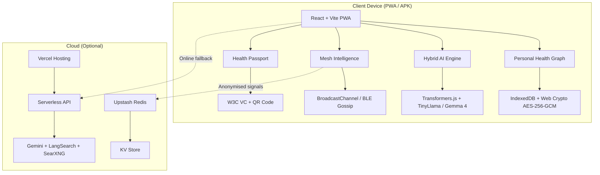

# VitaChain 🌍

[](https://vitejs.dev)
[](https://web.dev/pwa/)
[](https://offlinefirst.com)
[](LICENSE)
[]()
[](https://care-connect-lilac-nine.vercel.app)

**VitaChain** is an offline-first, self-sovereign AI health guardian that works without internet, syncs anonymously via mesh networks, and shares clinical summaries through QR codes — built for the Global South.

---

## Quick Start

```bash
# 1. Clone the repository
git clone https://github.com/nmesirionyengbaronye/vitachain.git
cd vitachain

# 2. Install dependencies
npm install

# 3. Start development server
npm run dev
```

Open [http://localhost:8080](http://localhost:8080) in your browser.

---

## Features

| Layer | Feature | Description |
|-------|---------|-------------|
| **Health Graph** | Personal Health Record | Encrypted on-device records (conditions, medications, allergies, encounters) using Automerge CRDTs |
| **Health Graph** | Clinical Tracking | 15+ trackers: nutrition, workouts, sleep, hydration, cycle, mental health, blood pressure, glucose, medications |
| **AI Engine** | Hybrid AI | Gemma 4 online + TinyLlama/Qwen offline — clinical summaries, drug checks, care gaps, structured 4-section output |
| **AI Engine** | Multi-Role | Patient, clinician, CHW personas with crisis detection, emotion awareness, and safety guardrails |
| **AI Engine** | Web-Augmented | LangSearch + SearXNG + PubMed + ClinicalTrials + OpenFDA + WHO GHO + disease.sh integration |
| **Mesh Network** | Gossip Protocol | Anonymous peer-to-peer via Bluetooth/BroadcastChannel — search counters, facility confirmations, outbreak signals |
| **Mesh Network** | Outbreak Detection | Automated spike detection from aggregated mesh data with real-time alerting |
| **Passport** | Health Passport | W3C Verifiable Credentials as QR codes — share health summaries with any clinician, no internet needed |
| **Passport** | QR Scanner | Camera-based scanning with image fallback for clinician-side credential verification |
| **Engagement** | Gamification | Rewards, quests, milestones, avatar customization, community health forums |
| **Education** | Health Literacy | Module-based health education with progress tracking |
| **Mobile** | APK Wrapper | Capacitor-powered Android APK with native Bluetooth, push notifications, camera access |

---

## Architecture



---

## Tech Stack

| Category | Technologies |
|----------|-------------|
| **Frontend** | React 18, TypeScript, Vite 5, Tailwind CSS, Framer Motion |
| **Offline AI** | Transformers.js v4, ONNX Runtime Web, TinyLlama 1.1B, Qwen, all-MiniLM-L6-v2 |
| **Online AI** | Google Gemini 4 (1,500 calls/day free), OpenRouter, HuggingFace Inference |
| **Data** | IndexedDB (50+ stores), Automerge CRDTs, Web Crypto API (AES-256-GCM) |
| **Search** | LangSearch API, SearXNG (14 public instances), DuckDuckGo fallback |
| **Medical APIs** | PubMed, ClinicalTrials.gov, OpenFDA, WHO GHO, disease.sh |
| **Mobile** | Capacitor 6, Android APK, Bluetooth LE, Push Notifications |
| **Deployment** | Vercel (static + serverless), PWA with Service Worker |

---

## Competition Entries

### Gemma 4 Good
VitaChain uses Google's Gemma model family for on-device medical AI that works without internet connectivity. The hybrid AI engine routes queries between Gemma 4 (online, via Gemini API) and TinyLlama (offline, via Transformers.js), ensuring healthcare AI is accessible even in zero-connectivity environments across the Global South.

### Abuja Innovation Challenge
Built specifically for Nigeria's healthcare fragmentation crisis. VitaChain addresses the 400,000 annual deaths from medication errors by giving patients a self-sovereign health record that follows them across providers. The mesh network enables anonymous outbreak detection in communities with limited infrastructure.

### Squad Hackathon 3.0
Integrated Squad payment gateway for premium features (subscription management, clinician verification). The PWA-first approach ensures the app works on any device with a browser, while Capacitor wrapping provides native Android capabilities for offline-heavy use cases.

---

## Live Demo

**Vercel Deployment:** [https://care-connect-lilac-nine.vercel.app](https://care-connect-lilac-nine.vercel.app)

> **Note:** AI features require initial model download (~1.3GB). After that, everything works fully offline.

---

## Environment Variables

Create a `.env.local` file:

| Variable | Description | Required |
|----------|-------------|----------|
| `VITE_CLERK_PUBLISHABLE_KEY` | Clerk auth publishable key | Yes |
| `VITE_GEMINI_API_KEY` | Google Gemini API key (free tier) | Yes |
| `VITE_LANGSEARCH_API_KEY` | LangSearch web search API key | Yes |
| `VITE_SEARXNG_INSTANCES` | Comma-separated SearXNG instances | Yes |
| `VITE_API_URL` | API base URL | Yes |
| `VITE_OPENROUTER_API_KEY` | OpenRouter fallback key | Optional |
| `VITE_HF_API_KEY` | HuggingFace Inference token | Optional |

---

## License

Copyright (C) 2026 Nmesirionye Ngbaronye

Distributed under the AGPL-3.0 License. See [LICENSE](LICENSE) for details.

---

## Contact

**Nmesirionye Ngbaronye**
- Email: nmesirionyengbaronye@gmail.com
- GitHub: [@nmesirionyengbaronye](https://github.com/nmesirionyengbaronye)

---

**Built with ❤️ for the Global South**

*Your health, your guardian. Anywhere.*