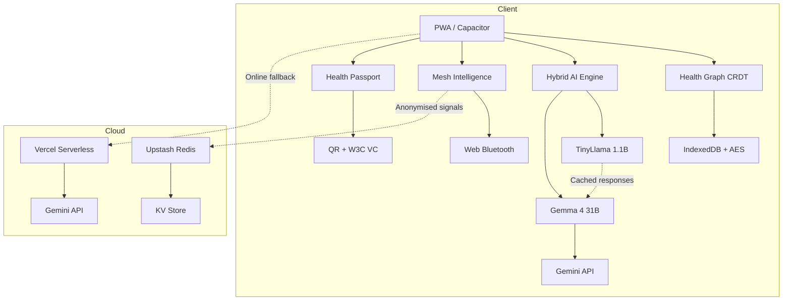
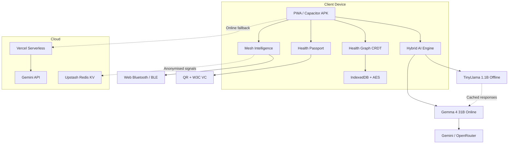

# VitaChain

A revolutionary AI-powered healthcare platform for Africa, combining offline-first architecture with advanced medical AI to deliver equitable healthcare access.

[](https://www.gnu.org/licenses/agpl-3.0)
[](https://github.com/Panther0508/vitachain)
[](https://care-connect-lilac-nine.vercel.app/)

## Quick Start

```bash
# Clone the repository
git clone https://github.com/Panther0508/vitachain.git
cd vitachain

# Install dependencies
npm install

# Start development server
npm run dev

# Build for production
npm run build
```

## Features

| Feature | Description | Status |
|---------|-------------|--------|
| AI-Powered Diagnostics | Gemma 4B model for medical consultations | ✅ |
| Offline-First Architecture | Full functionality without internet | ✅ |
| QR Code Health Passports | Verifiable credentials for patients | ✅ |
| Real-Time Health Monitoring | Integrated vitals tracking | ✅ |
| Community Health Worker Tools | Triage and protocol navigation | ✅ |
| Medication Management | Reminders and interaction checking | ✅ |
| Nutrition & Fitness Tracking | Personalized wellness plans | ✅ |
| Emergency Response System | Crisis detection and one-touch emergency call | ✅ |
| Multi-Role Authentication | Patient, Clinician, CHW, Admin roles | ✅ |
| Satellite Data Integration | Real-time health metrics from mesh networks | ✅ |
| Biometric Security | Native biometric authentication | ✅ |
| Multilingual Support | 10+ African languages | ✅ |
| PWA Installation | Installable web app | ✅ |
| Capacitor Mobile App | Android APK generation | ✅ |
| Vercel Deployment | Serverless API endpoints | ✅ |
| IndexedDB Storage | Local data persistence | ✅ |
| Real-Time Sync | Background data synchronization | ✅ |
| Lab Report OCR | Extract & explain lab results from images | ✅ |
| Guest Mode PIN Protection | Simple PIN gate for guest access | ✅ |
| Voice-Only Mode | Hands-free AI chat with TTS & Whisper STT | ✅ |
| Glassmorphism UI | Modern glass-card design system | ✅ |

## Architecture



## Tech Stack

- **Frontend**: React 18, TypeScript, Tailwind CSS
- **Backend**: Vercel Serverless Functions
- **AI/ML**: HuggingFace Transformers, Google Gemini
- **Storage**: IndexedDB, @vercel/kv
- **Mobile**: Capacitor 8
- **Maps**: Leaflet
- **Charts**: Recharts
- **Auth**: Clerk
- **Payments**: Paystack

## Competition Sections

### Gemma 4 Good Challenge
VitaChain leverages Google's Gemma 4B model for offline medical AI, ensuring ethical AI deployment in low-resource settings.

### Abuja Innovation Challenge
Targeted at improving healthcare access in Nigeria through innovative tech solutions.

### Squad Hackathon 3.0
Collaborative development with Squad's payment integration for seamless healthcare transactions.

## Live Demo

[https://care-connect-lilac-nine.vercel.app/](https://care-connect-lilac-nine.vercel.app/)

## License

This project is licensed under the GNU Affero General Public License v3.0 - see the [LICENSE](LICENSE) file for details.

## Contact

**Nmesirionye Ngbaronye**
- Email: nmesirionyengbaronye@gmail.com
- GitHub: [@Panther0508](https://github.com/Panther0508)

## Problem Statement
Healthcare in the Global South is severely fragmented. Medication errors cause over 400,000 preventable deaths annually. The chance of a patient’s health record being lost during a facility transfer is as high as 1-in-24, and 75% of clinical data remains siloed or inaccessible when needed most.

## Solution
VitaChain provides a revolutionary architecture to close the gap:
- **Personal Health Graph** — Encrypted on-device health records using Automerge CRDTs for seamless sync.
- **Mesh Intelligence** — Anonymous peer-to-peer gossip over Bluetooth/BLE for outbreak detection.
- **Universal Health Passport** — W3C Verifiable Credentials encoded as QR codes for offline sharing.
- **Data Sovereignty** — AES-256-GCM encryption ensuring no central server ever holds patient data.
- **Clinical-Grade AI** — Deep medical reasoning accessible in low-bandwidth environments.
- **Hybrid AI Engine** — Gemma 4 31B (online via Gemini API, 1,500 free calls/day, no credit card) for complex clinical reasoning; TinyLlama 1.1B for fully offline fallback; cached Gemma responses serve similar queries when offline.

## Key Features

| Feature | Description |
|---------|-------------|
| **Personal Health Graph** | Encrypted on-device health records (conditions, medications, allergies, encounters, immunizations, lab results, vitals, family history) using Automerge CRDTs |
| **Hybrid AI Engine** | Gemma 4 31B online + TinyLlama 1.1B offline + cached-response retrieval. Clinical summaries, medication interaction checks, differential diagnosis, ICD-10 coding, structured JSON output via function calling |
| **Multi-Role Support** | Patient (health companion), Clinician (decision-support), Community Health Worker (triage + protocol guidance), Admin (analytics + user management) |
| **Wellness Trackers** | Nutrition (food database with 150+ African foods + 500 global foods), Workout (800+ exercises), Cycle tracking, Mental Health (PHQ-9 / GAD-7), Sleep, Hydration, Medication reminders |
| **Rewards & Gamification** | VitaPoints, 15+ badges, streaks, quests, milestones, celebration animations |
| **Community Hub** | Topic-based discussion forums, posts, comments, likes — syncs via mesh |
| **Education Hub** | 30 bite-sized health education modules with quizzes (hypertension, diabetes, maternal health, first aid, etc.) |
| **Care Locator** | Offline-cached Leaflet map with facility pins, filter by type/distance, trust scores |
| **Emergency Medical ID** | Lock-screen accessible blood type, allergies, emergency contacts, SOS dial button |
| **Mesh Intelligence** | Anonymous peer-to-peer gossip over Bluetooth/BroadcastChannel — search counters, facility confirmations, stockout alerts, outbreak detection |
| **Universal Health Passport** | W3C Verifiable Credentials encoded as QR codes — share a structured pre-visit summary with any clinician, no internet needed |
| **Reasoning Trace & Citations** | Every AI response shows its chain-of-thought (data sources queried, retrieval steps, inference) with clickable source badges linking to original URL |
| **Built-In Evaluation** | Every AI response scored on Safety, Clarity, Usefulness, Medical Responsibility — viewable on an admin dashboard |
| **Emotion-Aware Conversations** | Detects user emotional state, adapts tone, threads emotional history across 10-turn conversations |
| **Crisis Detection** | Scans every user input for suicidal/self-harm language; triggers full-screen CrisisPopup with country-specific emergency numbers |
| **200+ Languages** | NLLB-200 offline translation (200 languages including 55 African languages) + Bergamot fallback |
| **Zero Cost** | Entire stack is open-source and free — no SaaS fees, no paywalls, no credit card required for any API |

## Architecture



## Tech Stack

**Frontend & Build:** React 18 + TypeScript, Vite, Tailwind CSS, React Router DOM, Framer Motion

**Offline AI (Browser-Native):** Transformers.js v4, ONNX Runtime Web, TinyLlama 1.1B (quantized ONNX, ~450 MB), Qwen 1.5 0.5B (CHW), all-MiniLM-L6-v2 (embeddings), NLLB-200 600M (translation, 200 languages), Whisper-tiny (speech-to-text), CLIP-ViT-Base-Patch32 (image classification), MedSAM-ViT-Base (image segmentation)

**Online AI (Free Tier):** Gemma 4 31B via Google AI Studio (1,500 calls/day free), OpenRouter (200 req/day free), HuggingFace Serverless (5,000 calls/month), LangSearch / SearXNG / DuckDuckGo (web search), PubMed E-utilities, ClinicalTrials.gov v2, OpenFDA, WHO GHO, disease.sh

**Local Data:** Automerge CRDT, IndexedDB, Web Crypto API (AES-256-GCM, PBKDF2)

**Mesh Networking:** BroadcastChannel (tab sync), Web Bluetooth (cross-device), Capacitor BLE plugin (APK), Service Worker Background Sync

**Identity & Sharing:** W3C Verifiable Credentials v2.0, ECDSA P-256 signatures (Web Crypto), QR generation (qrcode.js), QR scanning (html5-qrcode)

**Mobile Wrapper:** Capacitor 6 (Android APK), @capacitor-community/bluetooth-le, @capacitor/push-notifications, @capacitor/camera

**Deployment:** Vercel (static + serverless), Upstash Redis (KV store)

## Live Demo

**Vercel Deployment:** [https://care-connect-lilac-nine.vercel.app](https://care-connect-lilac-nine.vercel.app)

> The demo requires an initial model download (~450 MB for TinyLlama 1.1B; NLLB-200 translation model downloads on first use). After that, every AI feature works fully offline. The online path uses Gemma 4 31B via the free Gemini API tier (no credit card required).

## Competition-Specific Sections

#### 🏆 Gemma 4 Good Hackathon
- Uses Gemma 4 31B via Gemini API (online) — 1,500 free calls/day, no credit card
- Caches every Gemma response as an embedding in IndexedDB for offline retrieval
- TinyLlama 1.1B serves as offline fallback
- This is the "Gemma teaches TinyLlama" pattern
- Gemma 4's native function calling produces structured JSON (differential diagnoses with confidence scores, ICD-10 codes with specificity requirements, drug-interaction assessments with severity ratings)
- All structured output is cached and retrievable offline

#### 🏆 Abuja Innovation Challenge
- Working PWA + APK prototype, live at care-connect-lilac-nine.vercel.app
- Data sovereignty through architecture — no server, no cloud storage of patient records, everything encrypted on-device with AES-256-GCM
- NDP Act 2023 / GAID 2025 compliant (explicit consent manager, audit trail, data portability, right to erasure)
- All prizes are equity-free — the startup retains full IP ownership

#### 🏆 Squad Hackathon 3.0
- Offline-first AI with premium monetization through Squad's payment rails
- Free tier (Sabi): basic health guidance powered by TinyLlama 1.1B offline
- Premium tier (Oga ₦2,500/month): advanced clinical reasoning powered by Gemma 4 online, unlimited passport shares, priority mesh access
- Demonstrates Squad's APIs as the monetization layer for a health-tech product
- Aligned with "Smart Systems: The Intelligent Economy" theme

## Installation & Development

```bash
# 1. Clone the repository
git clone https://github.com/Panther0508/care-connect.git
cd care-connect

# 2. Install dependencies
npm install

# 3. Start development server
npm run dev
```

### Android APK Build
```bash
# 1. Build the PWA
npm run build

# 2. Sync with Capacitor
npx cap sync android

# 3. Open in Android Studio
npx cap open android
```

## Environment Variables

| Variable | Description |
|----------|-------------|
| `VITE_API_URL` | Vercel app URL for online search fallback |
| `VITE_GEMINI_API_KEY` | Google AI Studio API key (free, no credit card) |
| `VITE_LANGSEARCH_API_KEY` | LangSearch API key (free, no credit card) |
| `VITE_SEARXNG_INSTANCES` | Comma-separated list of SearXNG public instance URLs |
| `VITE_OPENROUTER_API_KEY` | OpenRouter API key (free tier) |
| `VITE_HF_API_KEY` | HuggingFace API token (free tier) |
| `VITE_SQUAD_PUBLIC_KEY` | Squad sandbox public key |
| `KV_REST_API_URL` | Upstash Redis REST endpoint (for facility cache) |
| `KV_REST_API_TOKEN` | Upstash Redis auth token |

## Project Structure

```text
care-connect/
├── public/
│   ├── data/           # 20+ JSON medical datasets
│   └── images/         # Exercise images, food SVGs, body maps, icons
├── src/
│   ├── components/     # UI components (GlassCard, Modals, Charts)
│   ├── services/       # Core logic
│   │   ├── ai/         # aiCoreRouter, hybridAIRouter, modelLoader, gemmaCache
│   │   ├── intelligence/# advancedRAG, evaluationEngine, personaEngine
│   │   └── safety/     # crisisDetector, emotionDetector
│   ├── pages/
│   │   ├── dashboards/ # Role-unique pages (Patient, Clinician, CHW, Admin)
│   │   └── wellness/   # Trackers (Nutrition, Workout, Cycle, etc.)
│   └── lib/            # Utilities (idb, auth, mesh)
└── capacitor.config.ts  # Mobile configuration
```

## Roadmap

### Phase 5 (Current)
- [x] PWA build & deployment
- [x] Universal Health Passport (VC + QR)
- [x] Hybrid AI Engine (Gemma 4 + TinyLlama + cached retrieval)
- [x] Bluetooth mesh (BroadcastChannel simulation + BLE transport)
- [x] All 4 role dashboards (Patient, Clinician, CHW, Admin)
- [x] 12+ wellness trackers
- [x] Community hub & education modules
- [x] Reward system & quests
- [x] Evaluation dashboard
- [x] Android APK build (Capacitor configured, pending Android Studio build)
- [x] Push notifications for outbreak alerts

### Phase 6 (Next)
- [ ] APK published to Google Play Store
- [ ] iOS support (Capacitor iOS)
- [ ] Real satellite sync (Starlink Direct-to-Cell / AST SpaceMobile)
- [ ] DHIS2 integration
- [ ] White-label deployment for state health ministries
- [ ] Fine-tuned Opus-MT African language medical translation models

## License
Distributed under the GNU Affero General Public License v3.0 (AGPL-3.0). See [LICENSE](LICENSE) for the full legal text.

Third-party components (Transformers.js, Gemma 4 models, etc.) remain under their original licenses (Apache 2.0, MIT, etc.). See [NOTICE.md](NOTICE.md) for the complete list.

## Acknowledgments
- **Google AI Studio** — Gemini API access
- **HuggingFace** — Model hosting and Transformers.js
- **LangSearch** — Free web-search API
- **FAO/INFOODS** — West African Food Composition Table
- **free-exercise-db** — Public-domain exercise data
- **FirstAidQA** — Emergency response dataset
- **Squad / HabariPay** — Payment infrastructure
- **HealthIcons.org** — CC0 medical icons
- **Capacitor** — Native mobile bridging
- **Automerge** — Local-first CRDTs